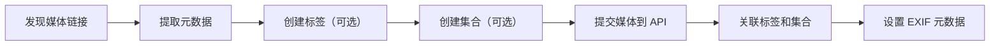

# 媒体采集 API - 采集接入文档

> 面向 **采集端** 的对接文档。说明如何通过 API 将照片/视频链接存入系统，以及采集流程的最佳实践。
>
> 客户端开发者请参阅另一份：[API 接口调用使用文档](./api-usage.md)

---

## 目录

1. [采集流程概览](#1-采集流程概览)
2. [认证与基础](#2-认证与基础)
3. [核心采集流程](#3-核心采集流程)
4. [采集字段详解](#4-采集字段详解)
5. [分步操作指南](#5-分步操作指南)
6. [采集最佳实践](#6-采集最佳实践)
7. [完整示例流程](#7-完整示例流程)
8. [常见问题](#8-常见问题)

---

## 1. 采集流程概览

```
                采集流程
  ┌──────────────────────────────────────────────────────┐
  │                                                       │
  │  采集源                  API                           │
  │   ┌─────┐    POST /media     ┌──────────────────┐    │
  │   │爬虫  │ ──────────────────→│                   │    │
  │   ├─────┤                     │    SQLite3 DB     │    │
  │   │手动  │    POST /tags      │   ┌────────────┐  │    │
  │   ├─────┤ ──────────────────→│   │ media_items │  │    │
  │   │插件  │                     │   │ collections │  │    │
  │   ├─────┤    POST /collections│   │ tags        │  │    │
  │   │RSS   │ ──────────────────→│   │ metadata    │  │    │
  │   └─────┘                     │   └────────────┘  │    │
  │                               └──────────────────┘    │
  └──────────────────────────────────────────────────────┘
```

### 典型采集步骤



---

## 2. 认证与基础

### 请求地址

```
协议：HTTP
基础 URL：http://your-server:8000/api/v1
数据格式：JSON (Content-Type: application/json)
字符编码：UTF-8
```

### 通用请求头

```http
Content-Type: application/json
Accept: application/json
User-Agent: MediaCollector/1.0
```

### 统一响应格式

```json
{
    "success": true,
    "code": 200,
    "message": "操作成功",
    "data": {}
}
```

| 字段 | 类型 | 说明 |
|------|------|------|
| `success` | bool | 是否成功 |
| `code` | int | HTTP 状态码 |
| `message` | string | 操作提示 |
| `data` | mixed | 返回数据 |

### 请求体规则

- POST/PUT 请求体必须是合法的 JSON
- 字符串字段默认值为空字符串 `""`
- 数字字段默认值为 `0`
- `null` 表示不设置该字段（使用数据库默认值）

---

## 3. 核心采集流程

### 3.1 从网页/URL 采集

建议流程：

```
1. 解析来源页面，提取出:
   - 原始媒体 URL
   - 标题 / 描述
   - 作者信息
   - 来源站 ID（用于去重）

2. 检查是否已采集（通过 source_id 去重）

3. 下载缩略图（可选）

4. 调用 API 入库
```

### 3.2 从本地文件采集

```
1. 读取本地文件
2. 计算 MD5（用于去重）
3. 获取文件 EXIF 数据
4. 拷贝到存储目录
5. 调用 API 入库，local_path 指向本地路径
```

### 3.3 API 采集接口清单

| 方法 | 路径 | 用途 | 调用频率 |
|------|------|------|----------|
| `POST` | `/api/v1/media` | **提交媒体** | 按需 |
| `POST` | `/api/v1/tags` | 创建标签（可选） | 按需 |
| `POST` | `/api/v1/collections` | 创建集合（可选） | 按需 |
| `POST` | `/api/v1/media/{id}/tags` | 给媒体打标签 | 按需 |
| `POST` | `/api/v1/collections/{id}/items` | 加入集合 | 按需 |
| `PUT` | `/api/v1/media/{id}/exif` | 写入 EXIF | 按需 |
| `PATCH` | `/api/v1/media/{id}` | 更新字段 | 按需 |

---

## 4. 采集字段详解

### 4.1 媒体主字段 (`POST /api/v1/media`)

```json
{
    "title": "日落时分",
    "description": "在黄山拍摄的日落",
    "url": "https://images.example.com/photo.jpg",
    "local_path": "",
    "type": "photo",
    "mime_type": "image/jpeg",
    "file_size": 2048576,
    "width": 1920,
    "height": 1080,
    "duration": 0,
    "thumbnail_url": "https://images.example.com/thumb.jpg",
    "source": "unsplash",
    "source_id": "photo-abc123",
    "source_url": "https://unsplash.com/photos/abc123",
    "author": "张三",
    "status": "active",
    "is_favorite": 0,
    "rating": 0,
    "sort_order": 0,
    "md5_hash": "",
    "tags": [],
    "metadata": {}
}
```

#### 必填字段

| 字段 | 类型 | 说明 |
|------|------|------|
| `url` | string | **媒体文件链接**（必填） |
| `type` | string | **媒体类型**：`photo` / `video` / `audio` / `document` / `other`（必填） |

#### 推荐字段（建议尽量提供）

| 字段 | 类型 | 说明 | 采集建议 |
|------|------|------|----------|
| `title` | string | 标题 | 从页面 title 或 alt 文本提取 |
| `description` | string | 描述 | 从页面描述/上下文提取 |
| `source` | string | 来源站点 | 固定值，如 `weibo`、`twitter`、`unsplash` |
| `source_id` | string | 来源 ID | **用于去重**，很重要！ |
| `source_url` | string | 来源页 URL | 方便溯源 |
| `author` | string | 作者名 | 从页面提取 |
| `thumbnail_url` | string | 缩略图 | 如有缩略图推荐传入 |
| `mime_type` | string | 文件 MIME 类型 | 可从 URL 后缀或 Content-Type 获取 |
| `file_size` | int | 文件大小（字节） | HEAD 请求获取 |
| `width` | int | 宽度（像素） | 图片可读取 |
| `height` | int | 高度（像素） | 同上 |

#### 可选字段

| 字段 | 类型 | 说明 |
|------|------|------|
| `duration` | int | 视频/音频时长（秒） |
| `local_path` | string | 本地下载路径 |
| `is_favorite` | int | 是否收藏标记 |
| `rating` | int | 评分 0-5 |
| `status` | string | `active`（默认） / `archived` / `trashed` / `failed` |
| `md5_hash` | string | 文件 MD5，用于本地去重 |
| `sort_order` | int | 排序权重 |

### 4.2 标签字段

```json
{
    "name": "风景",
    "slug": "landscape",
    "description": "自然风光摄影",
    "type": "subject",
    "color": "#22c55e"
}
```

| 字段 | 必填 | 说明 |
|------|------|------|
| `name` | ✅ | 标签显示名 |
| `slug` | ❌ | URL 友好标识，不传则自动生成 |
| `type` | ❌ | `general` / `location` / `person` / `event` / `subject` |
| `color` | ❌ | 十六进制颜色值，前端展示用 |

### 4.3 集合字段

```json
{
    "name": "2025 精选",
    "description": "年度精选作品",
    "type": "album",
    "parent_id": null,
    "cover_url": "",
    "sort_order": 0,
    "is_public": 1,
    "password": ""
}
```

| 字段 | 必填 | 说明 |
|------|------|------|
| `name` | ✅ | 集合名称 |
| `type` | ❌ | `album` / `folder` / `playlist` / `project` |
| `parent_id` | ❌ | 父集合 ID，实现树形嵌套 |
| `is_public` | ❌ | 是否公开 |

### 4.4 EXIF 字段（仅照片）

```json
{
    "camera_make": "Canon",
    "camera_model": "EOS R5",
    "lens_model": "RF 24-70mm f/2.8",
    "focal_length": "24mm",
    "aperture": "f/2.8",
    "shutter_speed": "1/1000",
    "iso": 100,
    "flash": 0,
    "gps_lat": 39.9042,
    "gps_lng": 116.4074,
    "gps_altitude": 50.5,
    "location_name": "北京故宫",
    "taken_at": "2025-06-15 10:30:00",
    "color_space": "sRGB",
    "orientation": 0
}
```

### 4.5 扩展元数据（任意自定义字段）

通过 `metadata` 表，可以在不修改表结构的情况下存储任意附加信息。

```json
{
    "metadata": {
        "ai_tags": "[\"日落\",\"云海\",\"金色\"]",
        "color_palette": "[\"#FF6B35\",\"#F7C59F\",\"#004E89\"]",
        "weather": "晴",
        "temperature": "28",
        "review_status": "approved"
    }
}
```

创建后还可单独添加：

```json
// POST /api/v1/media/1/metadata
{"key": "ai_description", "value": "一幅壮丽的日落山景照片"}
```

---

## 5. 分步操作指南

### 步骤一：创建标签（可选但推荐）

推荐先批量创建常用标签，也可以在提交媒体时自动创建。

**请求：**
```bash
curl -X POST http://localhost:8000/api/v1/tags \
  -H "Content-Type: application/json" \
  -d '{"name": "风景", "slug": "landscape", "type": "subject", "color": "#22c55e"}'
```

**响应：**
```json
{
    "success": true,
    "code": 201,
    "message": "标签创建成功",
    "data": {"id": 1}
}
```

### 步骤二：创建集合（可选）

创建层级集合来组织内容：

```bash
# 创建根集合
curl -X POST http://localhost:8000/api/v1/collections \
  -H "Content-Type: application/json" \
  -d '{"name": "2025 摄影", "type": "album"}'

# 创建子集合（parent_id 指向根集合）
curl -X POST http://localhost:8000/api/v1/collections \
  -H "Content-Type: application/json" \
  -d '{"name": "国内旅行", "type": "folder", "parent_id": 1}'
```

### 步骤三：提交媒体

```bash
curl -X POST http://localhost:8000/api/v1/media \
  -H "Content-Type: application/json" \
  -d '{
    "title": "黄山日落",
    "url": "https://images.example.com/sunset.jpg",
    "type": "photo",
    "source": "unsplash",
    "source_id": "photo-xyz789",
    "author": "摄影师",
    "tags": [1, 3],
    "metadata": {
        "weather": "晴",
        "ai_description": "一层金色的云海覆盖在山峰上"
    }
}'
```

**响应：**
```json
{
    "success": true,
    "code": 201,
    "message": "创建成功",
    "data": {"id": 42}
}
```

### 步骤四：关联到集合

```bash
curl -X POST http://localhost:8000/api/v1/collections/1/items \
  -H "Content-Type: application/json" \
  -d '{"media_id": 42, "note": "精选照片"}'
```

### 步骤五：写入 EXIF（照片）

```bash
curl -X PUT http://localhost:8000/api/v1/media/42/exif \
  -H "Content-Type: application/json" \
  -d '{
    "camera_make": "Canon",
    "camera_model": "EOS R5",
    "focal_length": "24mm",
    "gps_lat": 30.1337,
    "gps_lng": 118.1689,
    "location_name": "黄山"
}'
```

---

## 6. 采集最佳实践

### 6.1 去重策略

为防止重复采集同一媒体：

**方案 A：通过 `source_id` 去重（推荐）**

每条媒体记录应包含唯一的 `source_id`（来源站的原始 ID）。采集前先查询：

```bash
# 查询是否已存在
curl "http://localhost:8000/api/v1/media?source=unsplash&source_id=photo-xyz789"
```

如果返回空列表，则说明未采集过。

**方案 B：通过 `md5_hash` 去重**

对于本地文件：

```bash
# 计算文件 MD5
md5sum photo.jpg  # → a1b2c3...

# 查询是否已存在
curl "http://localhost:8000/api/v1/media?md5_hash=a1b2c3"
```

### 6.2 批量采集

批量提交媒体（每次请求一个，循环调用）：

```python
# Python 示例
import requests

media_list = [
    {"url": "...", "type": "photo", "source": "twitter", "source_id": "123"},
    {"url": "...", "type": "photo", "source": "twitter", "source_id": "456"},
    {"url": "...", "type": "photo", "source": "twitter", "source_id": "789"},
]

for media in media_list:
    resp = requests.post("http://localhost:8000/api/v1/media", json=media)
    if resp.status_code == 201:
        print(f"✓ {media['source_id']} → ID {resp.json()['data']['id']}")
    else:
        print(f"✗ {media['source_id']} → {resp.json()['message']}")
```

批量关联到集合：

```bash
# 一次添加多个媒体到集合
curl -X POST http://localhost:8000/api/v1/collections/1/items \
  -H "Content-Type: application/json" \
  -d '{"media_id": [42, 43, 44, 45]}'
```

### 6.3 字段补充策略

采集时可以分阶段补充信息：

```
阶段 1（实时）：URL + type + source_id → 快速入库
阶段 2（异步）：下载缩略图 → PATCH thumbnail_url
阶段 3（后台）：下载原图 → 分析 EXIF → PUT exif
阶段 4（离线）：AI 分析 → PATCH 扩展 metadata
```

### 6.4 采集速率建议

- 单次请求不要超过 1MB 的请求体
- 批量采集建议加 100-500ms 间隔，避免数据库繁忙
- 大文件信息采集建议先 HEAD 请求获取 file_size

### 6.5 错误处理

```json
// 400 Bad Request — 请求参数错误
{"success": false, "code": 400, "message": "链接地址不能为空"}

// 404 Not Found — 资源不存在
{"success": false, "code": 404, "message": "媒体不存在"}

// 409 Conflict — 重复
{"success": false, "code": 409, "message": "标签已存在"}

// 500 Server Error — 服务端错误
{"success": false, "code": 500, "message": "数据库错误：..."}
```

### 6.6 采集来源建议

建议在 `source` 字段中使用固定的英文标识：

| source 值 | 说明 |
|-----------|------|
| `unsplash` | Unsplash 免费图库 |
| `pexels` | Pexels 免费视频/图片 |
| `pixabay` | Pixabay 免费素材 |
| `twitter` | Twitter/X 图片 |
| `weibo` | 微博图片 |
| `pinterest` | Pinterest 采集 |
| `manual` | 手动添加 |
| `local` | 本地文件导入 |
| `crawl` | 通用爬虫采集 |
| `rss` | RSS 订阅源 |

---

## 7. 完整示例流程

以下是一个 Python 采集脚本的完整示例：

```python
"""
媒体采集示例脚本
从某个图站采集图片并提交到 API
"""
import requests
import time
import hashlib

API_BASE = "http://localhost:8000/api/v1"

class MediaCollector:
    def __init__(self, api_base=API_BASE):
        self.api = api_base.rstrip("/")
        self.session = requests.Session()
        self.session.headers.update({
            "Content-Type": "application/json",
            "Accept": "application/json",
            "User-Agent": "MediaCollectorBot/1.0",
        })

    def check_exists(self, source, source_id):
        """检查是否已采集"""
        resp = self.session.get(
            f"{self.api}/media",
            params={"source": source, "source_id": source_id, "page_size": 1}
        )
        return resp.json()["data"]["pagination"]["total"] > 0

    def ensure_tag(self, name, tag_type="general"):
        """确保标签存在，返回 tag_id"""
        resp = self.session.get(f"{self.api}/tags", params={"q": name})
        tags = resp.json()["data"]
        for t in tags:
            if t["name"] == name:
                return t["id"]
        # 创建新标签
        resp = self.session.post(f"{self.api}/tags", json={
            "name": name, "type": tag_type
        })
        return resp.json()["data"]["id"]

    def ensure_collection(self, name, parent_id=None):
        """确保集合存在"""
        resp = self.session.get(f"{self.api}/collections")
        for c in resp.json()["data"]:
            if c["name"] == name:
                return c["id"]
        data = {"name": name}
        if parent_id:
            data["parent_id"] = parent_id
        resp = self.session.post(f"{self.api}/collections", json=data)
        return resp.json()["data"]["id"]

    def submit_media(self, media_data, tags=None, collections=None):
        """提交一条媒体"""
        if tags:
            media_data["tags"] = tags
        resp = self.session.post(f"{self.api}/media", json=media_data)
        if resp.status_code == 201:
            media_id = resp.json()["data"]["id"]
            print(f"✓ 提交成功 ID={media_id}: {media_data.get('title', '无标题')}")
            # 关联集合
            if collections:
                for col_id in collections:
                    self.session.post(
                        f"{self.api}/collections/{col_id}/items",
                        json={"media_id": media_id}
                    )
            return media_id
        else:
            print(f"✗ 提交失败: {resp.json()['message']}")
            return None

    def batch_submit(self, items):
        """批量提交"""
        ids = []
        for i, item in enumerate(items):
            if self.check_exists(item["source"], item["source_id"]):
                print(f"→ [{i+1}/{len(items)}] 已存在，跳过: {item.get('title')}")
                continue
            time.sleep(0.2)  # 避免请求过快
            mid = self.submit_media(item)
            if mid:
                ids.append(mid)
        return ids


# ===== 使用示例 =====
if __name__ == "__main__":
    collector = MediaCollector()

    # 准备标签
    landscape_id = collector.ensure_tag("风景", "subject")
    travel_id = collector.ensure_tag("旅行", "event")

    # 准备集合
    album_id = collector.ensure_collection("2025 精选")
    china_id = collector.ensure_collection("国内旅行", parent_id=album_id)

    # 批量提交
    items = [
        {
            "title": "西湖日落",
            "url": "https://images.example.com/west-lake.jpg",
            "type": "photo",
            "mime_type": "image/jpeg",
            "source": "example",
            "source_id": "photo-west-lake-001",
            "author": "摄影师A",
        },
        {
            "title": "故宫雪景",
            "url": "https://images.example.com/forbidden-city.jpg",
            "type": "photo",
            "source": "example",
            "source_id": "photo-forbidden-002",
            "author": "摄影师B",
        },
    ]

    collector.batch_submit(items, tags=[landscape_id, travel_id], collections=[china_id])

    print("完成！")
```

---

## 8. 常见问题

**Q: 采集时返回 500 错误？**
A: 检查 JSON 格式是否正确，特别是最后一个字段后面不要有逗号。

**Q: 如何批量导入已有的媒体文件？**
A: 遍历本地文件，逐个调用 POST /media，设置 `local_path` 为本地路径，`url` 可为空或本地文件路径。

**Q: source_id 有什么用？**
A: 用于去重。当从同一来源反复采集时，通过 `source` + `source_id` 可以快速判断是否已存在，避免重复。

**Q: 采集视频需要注意什么？**
A: 设置 `type: "video"`，有缩略图请填写 `thumbnail_url`，时长填 `duration`（秒）。

**Q: 如何更新已采集的媒体？**
A: 使用 `PATCH /api/v1/media/{id}` 只发送需要更新的字段，或 `PUT` 全量覆盖。
